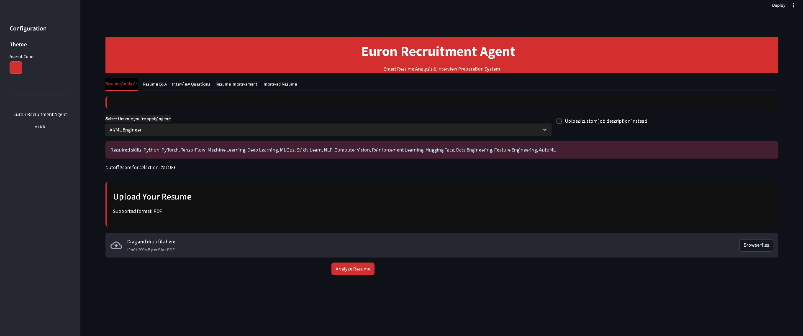

# 🤖 AI Recruitment Partner



## 📋 About This Project

**AI Recruitment Partner** is a powerful, privacy-focused recruitment assistant that runs entirely on your local machine. Built with cutting-edge AI technology, it helps both job seekers and recruiters streamline the hiring process through intelligent resume analysis, personalized interview question generation, and voice-based answer evaluation.

Unlike cloud-based solutions, all AI processing happens locally using **Llama 3** via Ollama and **Whisper** for audio transcription—ensuring your data never leaves your machine.

## ✨ Key Features

### For Job Seekers
- **📄 Resume Analysis**: Get instant, AI-powered feedback on your resume against specific job roles
- **💬 Resume Q&A**: Ask questions about your resume and receive intelligent answers
- **🎯 Personalized Interview Prep**: Practice with tailored interview questions based on your resume
- **🎤 Voice Answer Evaluation**: Record spoken answers and receive AI feedback on your responses
- **📈 Resume Improvement**: Get actionable suggestions to enhance your resume with specific examples
- **✍️ Resume Rewriting**: Generate an improved version of your resume optimized for target roles

### For Recruiters
- **⚡ Quick Resume Assessment**: Rapidly evaluate candidate resumes against job requirements
- **❓ Custom Interview Questions**: Generate relevant interview questions based on candidate profiles
- **🎙️ Voice Interview Analysis**: Evaluate candidate voice responses with AI-powered transcription and analysis
- **📊 Skill Scoring**: Automatic scoring of candidate skills against role requirements
- **🔍 Custom Job Descriptions**: Upload any job description and extract required skills automatically

## 🛠️ Tech Stack

- **Python 3.8+** - Core programming language
- **Streamlit** - Interactive web-based user interface
- **Ollama + Llama 3** - Local large language model for intelligent analysis
- **Whisper** - OpenAI's speech-to-text model for voice transcription
- **PyPDF2** - PDF resume parsing
- **audiorecorder** - Browser-based audio recording
- **pydub, numpy, pandas, matplotlib** - Data processing and visualization

## 🔐 Privacy-First Design

All AI processing and transcription happens **locally on your machine**. No data is sent to external servers, ensuring complete privacy and control over sensitive resume information.

## 📦 Prerequisites

Before installing, ensure you have the following:

1. **Python 3.8 or higher** - [Download Python](https://www.python.org/downloads/)
2. **Ollama** - [Download Ollama](https://ollama.com/download)
3. **Git** (optional, for cloning) - [Download Git](https://git-scm.com/downloads)

## 🚀 Installation & Setup

### Step 1: Clone or Download the Repository

```bash
git clone <your-repository-url>
cd "recruitment _agent"
```

### Step 2: Create a Virtual Environment (Recommended)

**On Windows:**
```bash
python -m venv venv
venv\Scripts\activate
```

**On macOS/Linux:**
```bash
python -m venv venv
source venv/bin/activate
```

### Step 3: Install Python Dependencies

```bash
pip install -r requirements.txt
```

### Step 4: Install and Setup Ollama

1. Download and install Ollama from [ollama.com/download](https://ollama.com/download)

2. Pull the Llama 3 model:
```bash
ollama pull llama3
```

3. Start the Ollama server (in a separate terminal):
```bash
ollama serve
```

Or run the model directly:
```bash
ollama run llama3
```

### Step 5: Install Whisper (if not already installed)

Whisper should be installed automatically via `requirements.txt`, but if needed:
```bash
pip install openai-whisper
```

## 🎬 How to Run

1. **Ensure Ollama is running** (start it in a separate terminal if needed)

2. **Activate your virtual environment** (if you created one):
   - Windows: `venv\Scripts\activate`
   - macOS/Linux: `source venv/bin/activate`

3. **Run the Streamlit app**:
```bash
streamlit run app.py
```

4. **Open your browser** and navigate to:
```
http://localhost:8501
```

The application interface will open automatically!

## 📖 How to Use

### Resume Analysis
1. Navigate to the **"Resume Analysis"** tab
2. Select a target job role (or upload a custom job description)
3. Upload your resume (PDF or TXT format)
4. Click **"Analyze Resume"** to get instant feedback
5. Review your skill scores, strengths, and areas for improvement

### Resume Q&A
1. After analyzing a resume, go to **"Resume Q&A"** tab
2. Ask questions like:
   - "What are my strongest skills?"
   - "What experience do I have with Python?"
   - "How well does my resume match this role?"
3. Receive AI-powered answers based on your resume

### Interview Questions
1. Navigate to **"Interview Questions"** tab
2. Select question types (Technical, Behavioral, Situational)
3. Choose difficulty level and number of questions
4. Click **"Generate Questions"** to get personalized interview questions
5. Record voice answers and get AI evaluation

### Resume Improvement
1. Go to **"Resume Improvement Suggestions"** tab
2. Select areas to improve (Skills, Experience, Projects, etc.)
3. Specify target role (optional)
4. Get detailed suggestions with example bullet points

### Improved Resume
1. Visit **"Improved Resume"** tab
2. Enter target role and skills to highlight
3. Generate an optimized version of your resume
4. Download the improved resume

## 📁 Project Structure

```
recruitment _agent/
├── app.py                      # Main Streamlit application entry point
├── agents.py                   # Core AI agent logic and resume analysis
├── ui.py                       # UI components and styling
├── requirements.txt            # Python dependencies
├── photo.png                   # Project banner image
├── PROJECT_OVERVIEW.md         # Detailed project documentation
├── LICENSE                     # MIT License
├── .streamlit/                 # Streamlit configuration
└── venv/                       # Virtual environment (created locally)
```

## 🎯 Example Use Case

**Scenario: Amit is applying for an AI/ML Engineer position**

1. Amit uploads his resume and selects "AI/ML Engineer" as the target role
2. The app analyzes his resume, scoring skills:
   - Python: 9/10
   - PyTorch: 6/10
   - MLOps: 4/10
3. Amit asks, "What are my main weaknesses for this role?"
   - AI responds: "Your MLOps experience is limited. Consider adding projects involving model deployment..."
4. The app generates 5 personalized interview questions
5. Amit records his answer to "Describe a deep learning project you've worked on"
6. The app transcribes and evaluates his response
7. Amit receives improvement suggestions for his resume
8. He downloads the improved resume with enhanced MLOps-related content

## 🔧 Troubleshooting

### Ollama Connection Error
- **Issue**: `Connection refused` or `Ollama server not responding`
- **Solution**: Ensure Ollama is running with `ollama serve` in a separate terminal

### Model Not Found
- **Issue**: `llama3 model not found`
- **Solution**: Pull the model with `ollama pull llama3`

### Audio Recording Not Working
- **Issue**: Microphone not detected
- **Solution**: Grant microphone permissions in your browser settings

### Whisper Installation Issues
- **Issue**: Error installing `openai-whisper`
- **Solution**: Install with: `pip install git+https://github.com/openai/whisper.git`

### Port Already in Use
- **Issue**: `Port 8501 is already in use`
- **Solution**: Run with a different port: `streamlit run app.py --server.port 8502`

## 🤝 Contributing

Contributions are welcome! Please feel free to submit a Pull Request.

## 📄 License

This project is licensed under the MIT License - see the [LICENSE](LICENSE) file for details.

## 🙏 Acknowledgments

- **Ollama** for providing local LLM infrastructure
- **OpenAI Whisper** for state-of-the-art speech recognition
- **Streamlit** for the amazing web framework
- **Llama 3** for powerful language understanding

## 📞 Support

For questions or issues, please open an issue on the GitHub repository.

---

**Built with ❤️ for making recruitment smarter and more private**
